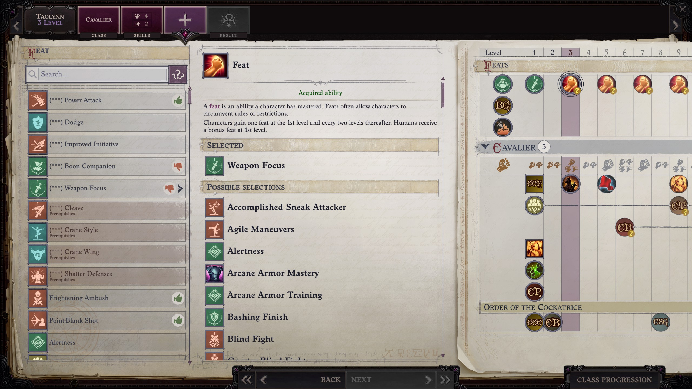

# Summary

This mod allows you to designate favorite feats per character in Pathfinder: Wrath of the Righteous. 
It's intended to help with remembering which feats you plan to take for characters to avoid re-evaluating all feats on each level up.

# Installation

Use Unity Mod Manager, which ships with Wrath of the Righteous, to install the mod. Just open the zip file with UMM and it will install.

# Basic Usage

**Be sure to read the next few bullet points, or else you'll run into some issues using the mod.** Sorry for some of the usability issues - I'm not sure how to resolve these easily with some modding limitations.

- You can't use this on the initial level 1 character creation screen. You can use it once a character is leveling up to level 2 or above. 
The feats you select at level 1 won't be saved, because the character doesn't have a name associated to it yet.
- To toggle the favorite status of a feat, do a double right click on a feat (like a double click with your mouse, except with your right mouse button). You'll hear a sound effect if successful.
- You won't see the favorite status update immediately. Go back one step on the character creation process and then forward to the feats screen again. 
Now you'll see `(***)` in front of favorite feats. 
- Note that you can favorite feats you don't qualify for yet. They'll appear at the top of your feats list to remind you of the feats you need to get prerequisites for.

# Further Usage Notes

- This mod does not affect your save files. It's safe to install and uninstall during a playthrough.
- Saves are by character name, so NPCs such as Lann will share their favorite feats across your different playthroughs. 
If you don't want this, you can keep multiple save files for NPCs in different playthroughs by handling the save files yourself - just look in the mod folder for save files like `v1-Lann.json` and create backups as you like.

# Links

- Github source code: https://github.com/stevejackson/FavoriteFeats_Wrath
- Github mod download: https://github.com/stevejackson/FavoriteFeats_Wrath/releases
- Nexus:
